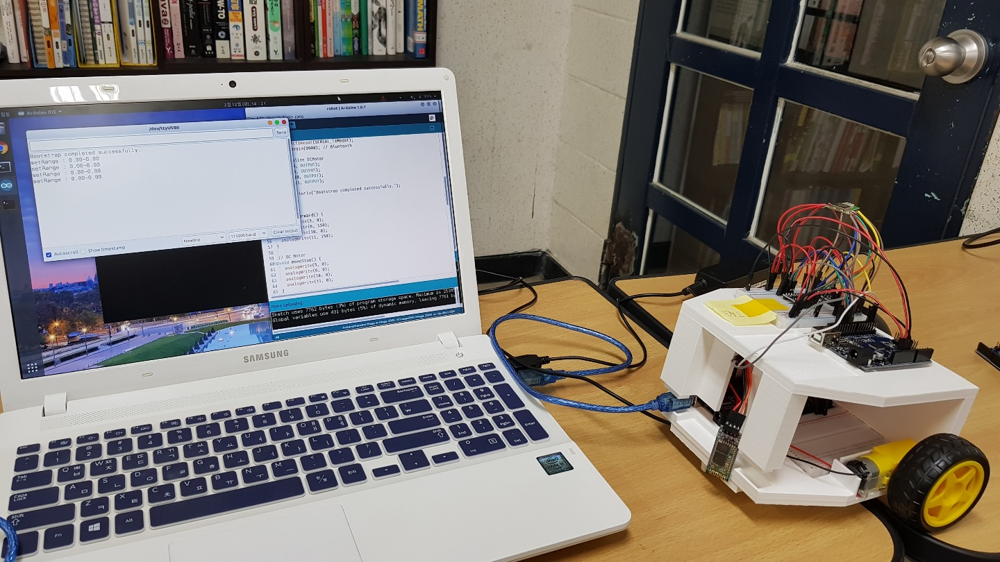
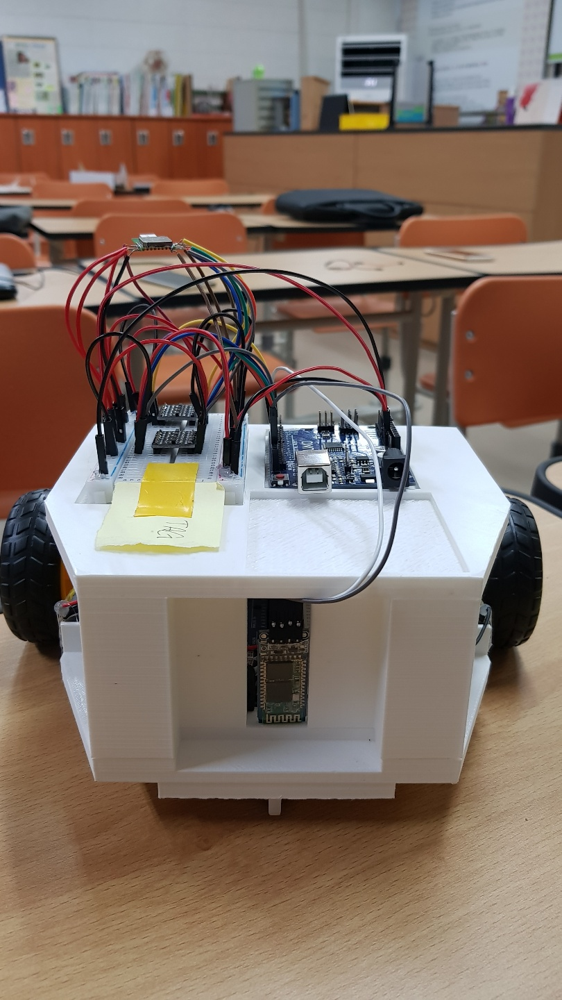

# 개요
`Kibot`은 강원중학교 안내 로봇입니다. 이 프로젝트는 현재 **유지보수계획이 없습니다.**

<!---->


> 2019년 2월 22일 대전 KT 인재개발원에서 열린 중소벤처기업부 주최, 한국과학창의재단 주관의 2018 하반기 메이커 문화확산사업 성과발표회 출품작입니다.


## Project structure
    .
    ├── android         # Kibot client for Android
    ├── client          # Kibot client written in flutter
    ├── core            # Kibot core implemented with Arduino
    │   ├── ips         # Indoor positioning system
    │   ├── robot       # Central processing software of the Kibot
    ├── docs            # Kibot documents
    ├── tests           # Test files
    └── README.md       # This file

## 교실 갱신 요청하기
Kibot client 는 애플리케이션 액티비티가 시작될 때 마다 `client/share/classinfo.json` 에 연결을 시도합니다.
연결에 성공하면 `classes.json` 에 저장하고, 다음 실행부터 인터넷에 연결할 수 없을 때 사용합니다.
`classinfo.json` 은 다음과 같은 구조입니다:

```json
{
  "101": "엄재훈 선생님",
  "102": "황은경 선생님",
  "103": "교무실"
}
```

모든 위젯은 액티비티가 만들어질 때 새로 고쳐집니다.

교실이 변경되었을 때 `client/share/classinfo.json`를 알맞게 수정해 `update request` label 을 붙여 issue를 작성하거나 이메일 (tdh8316@naver.com) 등을 이용해 연락을 취해주세요.

## 왜 Client에 `Flutter/Kotlin`을 사용했나요? 그냥 Java로 만들 것이지...

Flutter에서 사용하는 Dart 언어의 색이 마음에 들었어요 :trollface:


그리고 저는 자바 싫어요


# 진행 상태
 - [x] DWM1000 을 사용한 실시간 실내위치인식 체계 - `Arduino Uno`를 사용한 배선도 튜토리얼 추가 예정
 - [x] 원래 위치로 돌아오기
 - [x] DC모터 연결하기
 - [x] 블루투스를 사용한 클라이언트와 로봇 본체 간 무선 통신
 - [x] 3D 프린터를 사용해 외관 만들기
 - [ ] 초음파센서를 사용해 엘리베이터 타기
